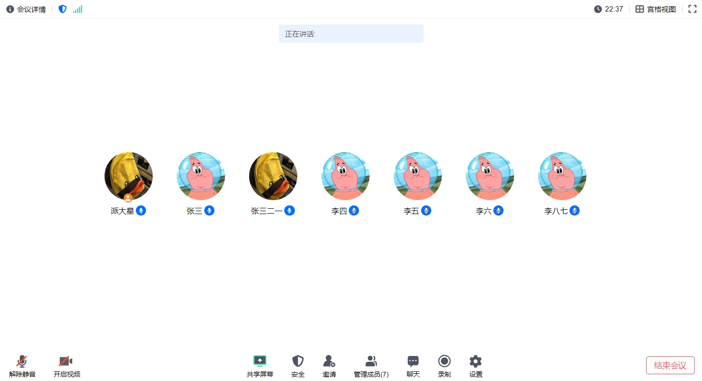

[[English]](README.md)

# 视频会议H5客户端

欢迎使用视频会议的React H5客户端！本项目旨在创建一个类似腾讯会议的H5客户端，包含前端UI和客户端SDK。

## 项目状态

- **UI开发：** 正在进行中
- **SDK开发：** 正在进行中
- **服务端组件：** 参见[项目](https://github.com/patstart/meeting-services)(开发中)

## 特性

- 类似腾讯会议的用户友好界面
- 实时视频和音频会议
- 易于与现有的SFU和后端服务集成
- 高性能和低延迟

## 预览




## 安装

本地安装和运行项目（在`app/`下）：

```bash
npm install
npm start
```

## 使用

- **UI：** 前端UI由React构建，设计简洁易用。
- **SDK：** 客户端SDK正在开发中，敬请期待。

## 贡献

欢迎贡献！请提交pull request或打开issue讨论改进或修复。

## 支持

你可以通过电子邮件或者微信(ID: patstar123)联系到我, 但我可能无法及时回复.

## 许可证

本项目采用MIT许可证。
