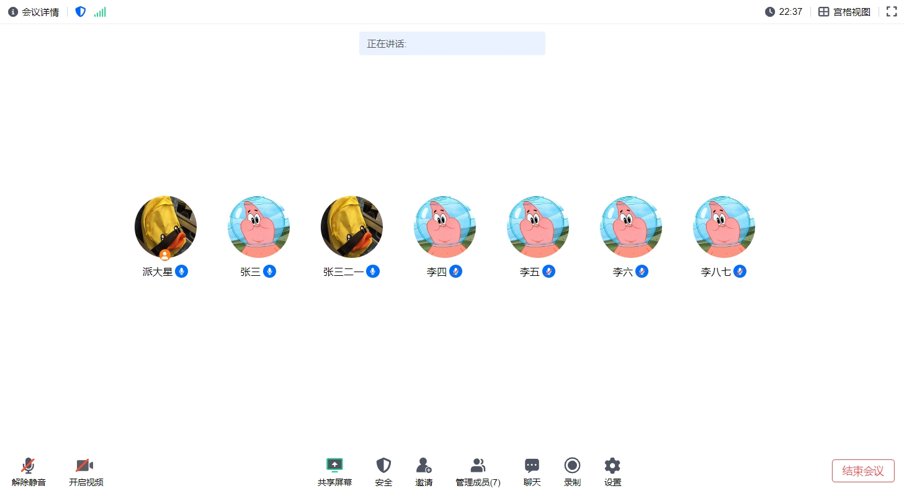

[[中文]](README.cn.md)

# H5 Client for Video Conferencing

Welcome to the React H5 Client for Video Conferencing! This project aims to create an H5 client similar to Tencent Meeting, featuring both frontend UI and client SDK.

## Project Status

- **UI Development:** Developing
- **SDK Development:** Developing
- **Server-Side Components:** See another [project](https://github.com/patstart/meeting-services)(In developing)

## Features

- User-friendly interface similar to Tencent Meeting
- Real-time video and audio conferencing
- Easy integration with existing SFU and backend services
- High performance and low latency

## Preview




## Installation

To install and run the project locally (in `app/`):

```bash
npm install
npm start
```

## Usage

- **UI:** The frontend UI is built with React and designed for ease of use.
- **SDK:** The client SDK is under development and will be available soon.

## Contributing

Contributions are welcome! Please submit a pull request or open an issue to discuss improvements or fixes.

## Support

You can reach me via Email or WeChat(ID: patstar123), but I might not be able to respond promptly.

## License

This project is licensed under the MIT License.
